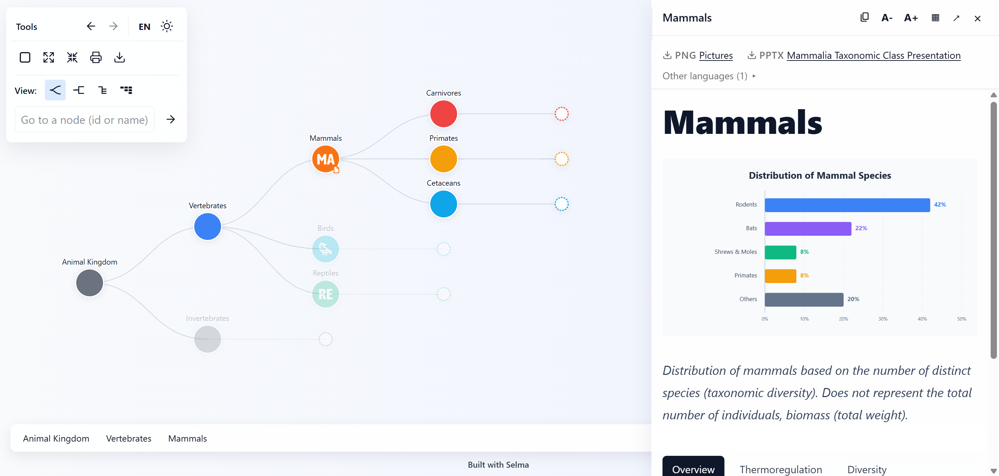

# Selma

[](https://huggingface.co/spaces/berangerthomas/selma) [](https://berangerthomas.github.io/selma/) [](LICENSE) [](https://github.com/berangerthomas/selma/releases) [](https://reactjs.org/) [](https://vitejs.dev/) [](https://d3js.org/) [](https://tailwindcss.com/)

Selma is a React + Vite application for visualizing and navigating hierarchical taxonomies. It renders a JSON-based tree as an interactive node-link diagram (D3.js), supports multilingual content, and provides export/print helpers for diagrams and node content.

<p align="center">
  
</p>

## Table of contents

- [Quick start](#quick-start)
- [Overview & key features](#overview--key-features)
- [Project layout & architecture](#project-layout--architecture)
- [Data schema (`structured_taxonomy.json`)](#data-schema-structured_taxonomyjson)
- [Content authoring & localization](#content-authoring--localization)
- [Screens & controls (UI)](#screens--controls-ui)
- [Deployment & CI](#deployment--ci)
- [Technical reference](#technical-reference)
- [Updating Selma (forks / upgrades)](#updating-selma-forks--upgrades)
- [FAQ / Troubleshooting](#faq--troubleshooting)
- [Contributing & development](#contributing--development)
- [License](#license)

## Quick start

Requirements: Node.js (LTS, Node 18+ recommended; project works with current stable Node versions). Using Node 24+ is fine if CI targets it.

Clone, install and run locally:

```bash
git clone https://github.com/berangerthomas/selma.git
cd selma
npm ci
npm run dev
```

Build for production and preview locally:

```bash
npm run build
npm run preview
```

## Overview & key features

- Programmatic rendering modes: transforms a structured JSON payload into interactive data using **four distinct visualization modes**:
  - `Organic`: Organic node-and-link clustered view.
  - `Compact`: Denser rectangular view with orthogonal connections.
  - `List`: Flat, familiar collapsible tree for purely textual navigation.
  - `Columns`: Miller Columns (like macOS Finder) for deep hierarchies.
- Modular architecture: decoupled UI components, translation logic and markdown-driven node content.
- Native localization: asynchronous loading of `taxonomy.json` and `ui.json` per language with safe fallbacks.
- Export & print: inline fonts/images into exported SVG; produce PNG/JPG via canvas rasterization. Note that PNG and JPG exports have maximum dimension constraints imposed by browser memory limits (e.g., around 16,000 pixels for Chrome). The tool dynamically downscales the image to fit this limit. If the taxonomy tree is extremely large and exceeds this even at minimal scale, an error message is displayed recommending the SVG export, which is vector-based and has no such mathematical graphic limits.

## Project layout & architecture

Top-level layout (important folders and files):

- `public/` — static assets and runtime content
	- `public/structured_taxonomy.json` — canonical taxonomy tree (source of truth)
	- `public/details/[lang]/[nodeId].md` — localized Markdown per node
	- `public/locales/[lang]/taxonomy.json` — node translations (names and optional icon overrides)
	- `public/locales/[lang]/ui.json` — interface strings
- `src/` — React + D3 application
	- [src/context/TreeContext.tsx](src/context/TreeContext.tsx) — application state, search and URL sync
	- [src/components/TreeViz.tsx](src/components/TreeViz.tsx) — D3 layout and rendering
	- [src/components/Sidebar.tsx](src/components/Sidebar.tsx) — node detail panel and Markdown loader
	- [src/components/MarkdownRenderer.tsx](src/components/MarkdownRenderer.tsx) & [src/components/TabbedMarkdown.tsx](src/components/TabbedMarkdown.tsx) — markdown rendering and tab extraction
	- [src/hooks/useTaxonomyData.ts](src/hooks/useTaxonomyData.ts) — taxonomy fetch and caching

Data flow (high level):

1. App fetches `/structured_taxonomy.json` on startup (`useTaxonomyData`).
2. `TreeViz` prunes/arranges the tree and renders the SVG with D3.
3. Selecting a node triggers `Sidebar` to fetch `/details/<lang>/<nodeId>.md` (fallback to unlocalized file) and render tabs from `##` headers.
4. Translations are loaded via `i18next` HTTP backend configured in [src/i18n.tsx](src/i18n.tsx).

Notes:
- Keep user-provided content under `public/locales/` and `public/details/` to simplify upgrades.
- Supported languages are discovered at build/start using `import.meta.glob`; after adding a new `public/locales/<lang>/` folder restart the dev server.

## Customizing Graph Margins

If you want to adjust how the graph fits within the screen (its margins) when entering "fit view" mode, look in `src/components/TreeViz.tsx` inside the `computeTransform` function. You can modify the `visualMinY`, `visualMaxY`, `visualMinX`, and `visualMaxX` values to add or reduce empty space around the graph.

**Note on D3 coordinates:** Because the tree is horizontal (grows from left to right), the D3 axes are inverted relative to the screen. D3's "Y" represents depth (horizontal on screen) and "X" represents breadth (vertical on screen).

To adjust specific margins, modify these lines in `computeTransform`:
- `visualMinY`: Adjusts the **Left** margin (space before the root node).
- `visualMaxY`: Adjusts the **Right** margin (space after the deepest nodes, usually for text).
- `visualMinX`: Adjusts the **Top** margin.
- `visualMaxX`: Adjusts the **Bottom** margin.

## Data schema (`structured_taxonomy.json`)

Minimal node example:

```json
{
	"id": "mammals",
	"name": "Mammals",
	"color": "#f97316",
	"image": "/assets/nodes/mammal.svg",
	"iconChar": "🐾",
	"iconFont": "\\"NotoEmoji\\"",
	"children": []
}
```

Field reference:

- `id` (string, required): stable identifier for lookups, translations and URLs. Recommended pattern: `^[a-z0-9_\\\\-]+$`. Avoid renaming ids.
- `name` (string): default label shown when no translation exists.
- `color` (string, optional): CSS color for node background.
- `image` (string, optional): path under `/assets/` used as a node image.
- `iconChar` (string, optional) and `iconFont` (string, optional): glyph-based icons.
- `attachments` (array of objects, optional): list of downloadable files (e.g. `[{"name": "Report", "path": "/attachments/node_id/report.pdf", "format": "pdf", "lang": "en"}]`). The optional `lang` field restricts an attachment to a specific language: attachments with a `lang` are shown only when the UI language matches that value; attachments without `lang` are language-agnostic and shown for all languages.
- `attachments` (array of objects, optional): list of downloadable files (e.g. `[{"name": "Report", "path": "/attachments/node_id/report.pdf", "format": "pdf", "lang": "en"}]`). The optional `lang` field restricts an attachment to a specific language: attachments with a `lang` are shown only when the UI language matches that value; attachments without `lang` are language-agnostic and shown for all languages.

Attachment display behavior (UI):

- The viewer shows attachments compactly in this order: language-agnostic files (no `lang`), then files matching the current UI language, then other-language files grouped under a collapsible "Other languages" section.
- This preserves a single, compact top-line for the most relevant documents while still exposing translations and extras on demand.
- `lang` remains optional in the schema; keep it for translated files (or consider `langs: string[]` if a file targets multiple languages).

- `children` (array): nested node objects.

Precedence for visuals: localized overrides (in `public/locales/<lang>/taxonomy.json`) → `image` → `iconChar`/`iconFont` → text label.

Recommended practices:

- Keep `id` stable and compact.
- Prefer `/assets/` absolute paths for images.
- Use `image` for rich SVG icons and `iconChar` for lightweight glyphs.

## Content authoring & localization

File locations & resolution:

- Localized node content: `public/details/<lang>/<nodeId>.md`.
- Fallback: `/details/<nodeId>.md` if localized file is missing.
- Translations: `public/locales/<lang>/taxonomy.json` (node data) and `public/locales/<lang>/ui.json` (interface strings).

Authoring notes for Markdown:

- Use a single H1 title. Content before the first `##` becomes the intro.
- Use `##` to create tabs (handled automatically by `TabbedMarkdown`).
- Prefer absolute `/assets/...` paths for images stored in `public/`.

Images and icons:

- Absolute paths starting with `/` resolve from `public/`.
- Relative paths in Markdown are resolved relative to the Markdown file by `MarkdownRenderer`.
- For webfonts, add files under `public/assets/fonts/` and reference them from `public/assets/fonts/custom-fonts.css`.

Localization model:

- `public/locales/<lang>/taxonomy.json` maps node ids → localized `name` and optional `iconChar`/`iconFont`.
- `public/locales/<lang>/ui.json` contains interface strings used by `i18next`.

### Translations maintenance (dev-only Settings modal)

- Location & access: In development mode only (`import.meta.env.DEV === true`), a gear icon appears in the floating toolbar header. Click it to open the **Settings** modal and switch to the **Translations** tab.

- Purpose: the Translations tab helps maintain parity between the canonical taxonomy (`public/structured_taxonomy.json`) and the per-language `public/locales/<lang>/taxonomy.json` files. It computes coverage per language, lists missing node ids with English name hints, and allows downloading a fully scaffolded `taxonomy.[lang].json` file ready for translators.

- How it works:
	1. The modal fetches `public/structured_taxonomy.json` and each `public/locales/<lang>/taxonomy.json` directly (via `fetch()`), so it reports the persisted on-disk state rather than any in-memory i18next cache.
 2. For each language the UI shows `translated_count / total_count` and a status indicator. Expanding an incomplete language reveals the missing node IDs and their English `name` values from the structured taxonomy.
 3. Clicking `⬇ taxonomy.[lang].json` downloads a complete JSON file that merges existing translations and injects missing entries as `{ "name": "[TODO] <English name>" }`. Existing translations are preserved and never overwritten.

	 You can also copy the scaffolded JSON directly to the clipboard from the Settings modal (dev-only) using the new "Copy" action — handy for pasting into an editor or creating a quick PR without saving the file first.

- How to use the downloaded scaffold:
	1. Download `taxonomy.<lang>.json` from the Translations tab.
	2. Move the file into your project at `public/locales/<lang>/taxonomy.json`. If a `taxonomy.json` already exists, either replace it (recommended when you're intentionally committing the full updated file) or manually merge the new entries into the existing file.
	3. Edit the file and replace any `name` values prefixed with `[TODO] ` with the proper translated string. Keep the node `id` keys unchanged.
	4. Commit and push the updated translation file with a descriptive message (e.g., `git add public/locales/fr/taxonomy.json && git commit -m "locales(fr): scaffold and add missing taxonomy translations"`).
	5. If you added an entirely new `public/locales/<lang>/` folder, restart the dev server so the build-time locale detection picks it up. Otherwise a simple page reload in dev mode is usually sufficient.

- Notes and caveats:
	- The download is a client-side Blob and currently does not write files to the repository automatically; the code contains a `// TODO: replace with backend API call` comment where a backend write could be enabled in the future.
	- The scaffold uses the English `name` from `structured_taxonomy.json` as a translator hint; translators should remove the `[TODO] ` prefix when they provide the real translation.
	- This feature is intentionally gated to development builds only and will not be exposed in production.


## Screens & controls (UI)

Main UI areas:

- Central interactive SVG tree (`TreeViz`) — pan/zoom, cluster/collapse behaviour.
- Floating Toolbar — search, language/theme toggles, fit/expand/collapse, export.
- Sidebar — node Markdown viewer with tab extraction from `##` headings.

Key interactions:

- Click a node to show details in the Sidebar; the URL is synchronized with `?node=<id>` for deep links.
- Nodes that have file attachments show a small document indicator in every view mode, so users can identify downloadable content before opening the sidebar.
- Search by id/name and cycle results with next/previous controls.
- Use the toolbar for language switching, theme toggle and exporting the current view.
- Adjust the reading text size dynamically from the Sidebar or the standalone Markdown viewer.

Export & print behavior per view mode:

| View mode | Print | Export formats |
|-----------|-------|----------------|
| **Organic / Compact** | Prints the SVG tree | SVG, PNG, JPG |
| **List / Miller Columns** | Prints the HTML page | Plain text tree (`.txt`) |

Notes on export:
- **SVG/PNG/JPG** exports are only available in the graph views (Organic and Compact) because they rasterize the D3 SVG canvas.
- **PNG and JPG** exports have maximum dimension constraints imposed by browser canvas memory limits (e.g., around 16,000 pixels for Chrome). The tool dynamically downscales the image to fit this limit. If the taxonomy tree is extremely large and exceeds this even at minimal scale, an error message is displayed recommending the SVG export, which is vector-based and has no such mathematical graphic limits.
- **Text export** is available in List and Miller Columns views. It generates an ASCII tree representation using box-drawing characters (e.g., `├── Mammals`) and downloads it as a `.txt` file.

Implementation pointers:

- [src/components/TreeViz.tsx](src/components/TreeViz.tsx) — D3 layout, pruning and rendering logic.
- [src/components/Toolbar.tsx](src/components/Toolbar.tsx) — buttons and toolbar actions.
- [src/components/Sidebar.tsx](src/components/Sidebar.tsx) — Markdown fetching and rendering.

## Deployment & CI

Build and preview locally:

```bash
npm ci
npm run build
npm run preview
```

## Technical reference

Quick pointers to useful files and APIs:

- Data fetch: [src/hooks/useTaxonomyData.ts](src/hooks/useTaxonomyData.ts)
- Global context / state: [src/context/TreeContext.tsx](src/context/TreeContext.tsx)
- Visualization: [src/components/TreeViz.tsx](src/components/TreeViz.tsx)
- Markdown rendering: [src/components/MarkdownRenderer.tsx](src/components/MarkdownRenderer.tsx)
- Utilities: [src/utils/treeUtils.ts](src/utils/treeUtils.ts), [src/utils/localization.ts](src/utils/localization.ts)
- Export/print: [src/hooks/usePrintSVG.ts](src/hooks/usePrintSVG.ts), [src/hooks/usePrintMarkdown.ts](src/hooks/usePrintMarkdown.ts)

`useTree()` (exposed by `TreeContext`) basic API:

- `data: TreeNode` — loaded taxonomy
- `expanded: Set<string>` — expanded node ids
- `activeId: string` — selected node id
- `toggleNode(id: string)`, `setActiveId(id: string)`, `collapseAll()`, `expandAll()`

Type definition (see [src/types.ts](src/types.ts)):

```ts
export type TreeNode = {
	id: string
	name: string
	color?: string
	image?: string
	iconChar?: string
	iconFont?: string
	attachments?: {
		name: string
		path: string
		format: string
		lang?: string
		size?: number
	}[]
	children?: TreeNode[]
}
```

## Updating Selma (forks & upgrades)

Keep user data separate from the application code to simplify updates. Files and folders you should NOT overwrite when updating:

- `public/structured_taxonomy.json`
- `public/details/` (node markdown files)
- `public/locales/<lang>/taxonomy.json`
- `public/assets/`

Updating options:

- Manual ZIP update: replace `src/`, `package.json`, `vite.config.ts`, `index.html` but preserve `public/` data folders.
- Fork + rebase (recommended):

```bash
git remote add upstream https://github.com/berangerthomas/selma.git
git fetch upstream
git checkout main
git rebase upstream/main
# resolve conflicts (preserve your public/locales and public/details changes)
git push --force-with-lease origin main
```

Alternative: merge instead of rebase if you prefer not to rewrite history.

See [docs/updating-fork.md](docs/updating-fork.md) for full instructions.

## FAQ / Troubleshooting

- Images or Markdown do not load: ensure content is under `public/details/` and referenced with correct paths; check network requests in devtools.
- Translations missing: verify `public/locales/<lang>/taxonomy.json` and `ui.json` and restart dev server after adding a new locale.
- Export issues (fonts/icons missing): ensure fonts are reachable (CORS) and included in `public/assets/fonts/` if serving locally.

## Contributing & development

Typical developer workflow:

```bash
npm ci
npm run dev
npm run build
```

- Build the docs site (if you want to preview the VitePress documentation):

```bash
npx vitepress build docs
npx vitepress dev docs
```

If you contribute, please open a PR, keep changes focused and test locally.

## License

This project is licensed under the MIT License — see [LICENSE](LICENSE).
